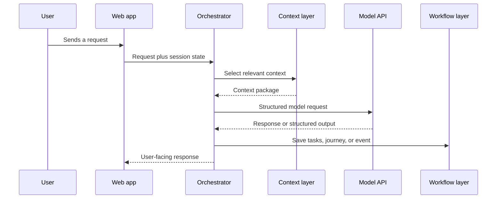

# Product architecture

This document explains the TalkToLorenzo system at a public, product-architecture level. It deliberately omits proprietary implementation details, prompts, credentials, and internal data structures.

## Design objective

TalkToLorenzo is designed to move beyond single-turn answers. Its central requirement is continuity: the system should understand what the user was working on, preserve useful context, and help identify the next valuable action.

## Core components

### 1. Conversation experience

The web interface provides multilingual conversations and access to saved work. The goal is to make specialist modes feel like one coordinated team rather than disconnected chatbots.

### 2. Orchestration and routing

The orchestration layer determines which specialist mode, context, tools, and workflow are relevant to a request. It also normalizes outputs so they can be saved or acted on elsewhere in the product.

### 3. Context and continuity

The product assembles relevant context from the current conversation, prior work, the active journey, and user state. Long-term usefulness depends on selecting the right context—not simply passing every previous message back to a model.

### 4. Structured work layer

Useful conversation outputs can become:

- journeys;
- tasks and next steps;
- saved resources;
- decisions and progress markers;
- qualification or handoff events.

This layer connects a model response to an ongoing piece of work.

### 5. Attribution and human handoff

For white-label implementations, the system can connect a conversation to lead attribution, qualification, routing, and a human follow-up. The aim is to preserve the context already gathered instead of forcing the user to repeat it.

## Simplified request flow

## Key design decisions

### Continuity over novelty

The primary value is not another chat surface. It is preserving momentum between sessions and turning advice into follow-through.

### Orchestration over model training

TalkToLorenzo uses hosted model APIs. The core engineering and product work is orchestration: context selection, routing, structured workflows, memory behavior, interface design, and operational integration.

### Specialist modes with shared context

Specialists have different purposes, but they operate within a shared product experience. This reduces fragmentation and lets one workflow inform another.

### Human escalation where it matters

AI is not treated as the correct endpoint for every interaction. High-value or qualified cases can move into human workflows with the relevant context attached.

## Technology boundaries

- Wix and Velo provide the application and delivery environment.
- JavaScript and backend services implement product and workflow logic.
- Hosted model APIs provide language-model capabilities.
- Payment-provider integrations support subscriptions.
- Private storage holds product state and user-specific continuity data.

No production endpoints, internal collection names, credentials, or security-sensitive configuration are disclosed in this repository.

