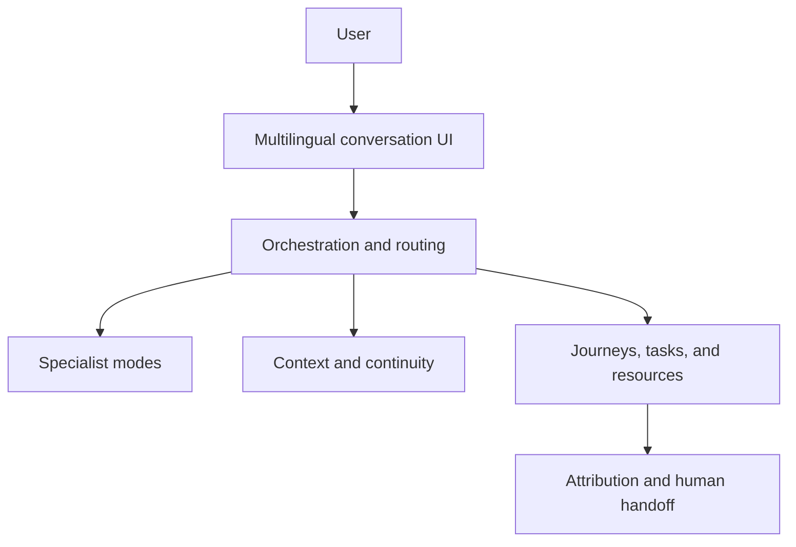

# TalkToLorenzo

### A continuity-first, multilingual AI workspace for entrepreneurs

[Live product](https://www.talktolorenzo.com) · [Founder](https://www.bestofyou.io) · [LinkedIn](https://www.linkedin.com/in/vojnits/)

> This is a public product and architecture showcase. Production source code, proprietary prompts, credentials, and user data remain private.

*A product-level view of the connected AI team, shared continuity layer, and the journey from early experiments to the current platform.*

## Why it exists

Most AI tools answer a question once. When the user returns, they often have to reconstruct the context and decide what to do next.

TalkToLorenzo was built around a different idea: **AI should remember where the work stopped and help move it forward.** It turns conversations into an ongoing workspace of saved journeys, tasks, resources, decisions, and next steps.

## What the product does

- Maintains continuity across conversations and sessions
- Routes work to specialist AI modes with distinct responsibilities
- Converts conversations into structured journeys, tasks, and resources
- Supports English, Spanish, and Hungarian experiences
- Gives users one dashboard for conversations and follow-through
- Connects AI conversations to attribution and human handoff workflows
- Supports white-label adaptations for different industries

## Product experience

The dashboard brings conversations, specialist modes, tasks, journeys, saved resources, and suggested next actions into one workspace.

## The AI team

| Specialist | Role |
|---|---|
| **Lorenzo** | Business strategist, guide, and continuity layer |
| **Nora** | Knowledge architect |
| **Sofia** | Social media manager |
| **Leo** | Growth specialist |
| **Ava** | Communication specialist |

The specialists are not separate foundation models. They are product modes created through orchestration, context assembly, workflows, and purpose-specific interaction design.

## System view

For a deeper product-level view, see [Architecture](docs/ARCHITECTURE.md).

## My role

I am **Bálint Vojnits**, the founder and product architect of TalkToLorenzo. I led the product from concept to a working, user-facing system, including:

- Product strategy and interaction design
- Full-stack MVP delivery using Wix and Velo
- AI orchestration, routing, context, and memory design
- Multilingual journeys and structured outputs
- Subscription, attribution, and human-handoff workflows
- Testing with real users and iterative product decisions
- White-label prototypes for real estate and e-commerce

I use AI coding tools as force multipliers, while retaining responsibility for product decisions, system design, integration, testing, and delivery.

## Technical implementation

| Layer | Implementation |
|---|---|
| Presentation | Wix, Velo, JavaScript, HTML/CSS components |
| Application | Velo backend services, member state, workflow logic |
| AI | Model APIs, orchestration, routing, context assembly, structured responses |
| Continuity | Conversation events, saved journeys, tasks, resources, next-step logic |
| Commercial | Subscription and payment-provider integrations |
| Operations | Attribution, lead qualification, routing, and human handoff |

The system uses hosted AI models through APIs. I did not train a proprietary foundation model; the technical work is in turning model capabilities into a coherent, live product.

## White-label validation

The same core architecture has also been adapted into prototypes for:

- **Epique Mexico:** real-estate buyer, seller, and agent-recruitment journeys with qualification and routing
- **ShelfyCart:** an e-commerce adaptation exploring guided product discovery and conversion

These prototypes tested whether the underlying conversation, continuity, and workflow architecture could transfer beyond the original product.

## Current status

TalkToLorenzo is a live, evolving product. It has been used by real users and has produced working multilingual and white-label experiences. It has not yet reached its full commercial target; the project remains an honest example of building, learning, and shipping under uncertainty.

## Repository scope

This repository contains:

- A public product overview
- Product-level architecture documentation
- A user journey walkthrough
- Public screenshots

It intentionally does **not** contain:

- Production source code or internal schemas
- Proprietary prompts or orchestration rules
- API keys, credentials, or environment configuration
- Customer, conversation, or other personal data

## Contact

**Bálint Vojnits**  
[balint@bestofyou.io](mailto:balint@bestofyou.io) · [bestofyou.io](https://www.bestofyou.io) · [LinkedIn](https://www.linkedin.com/in/vojnits/)
